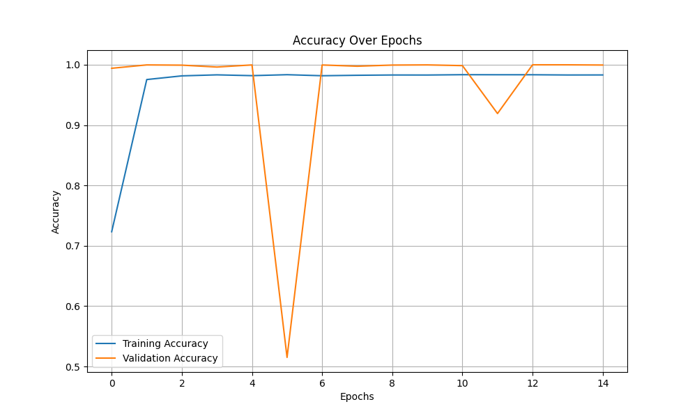
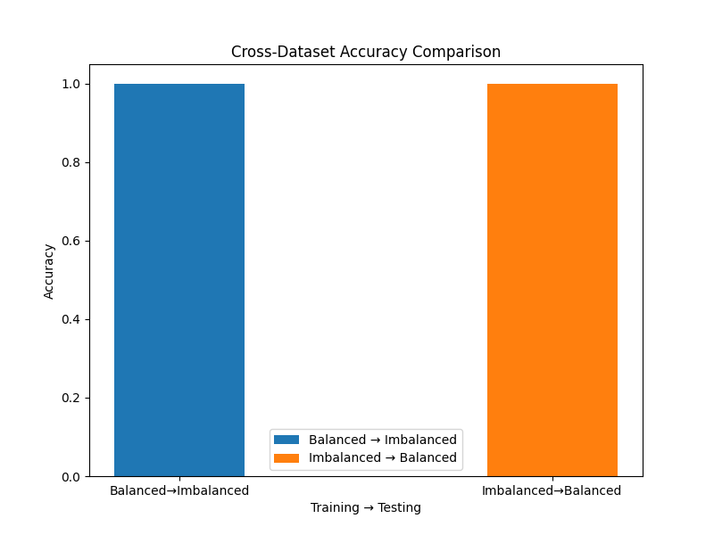
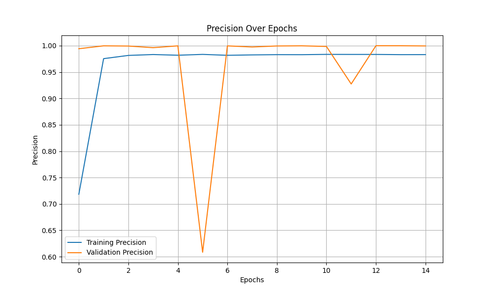
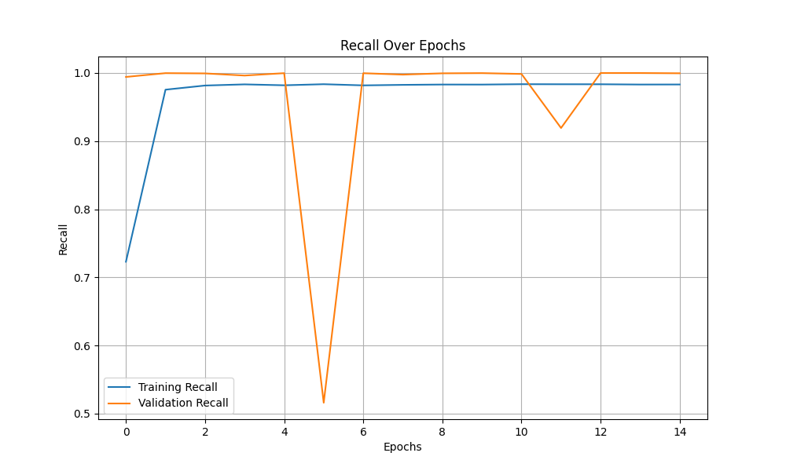
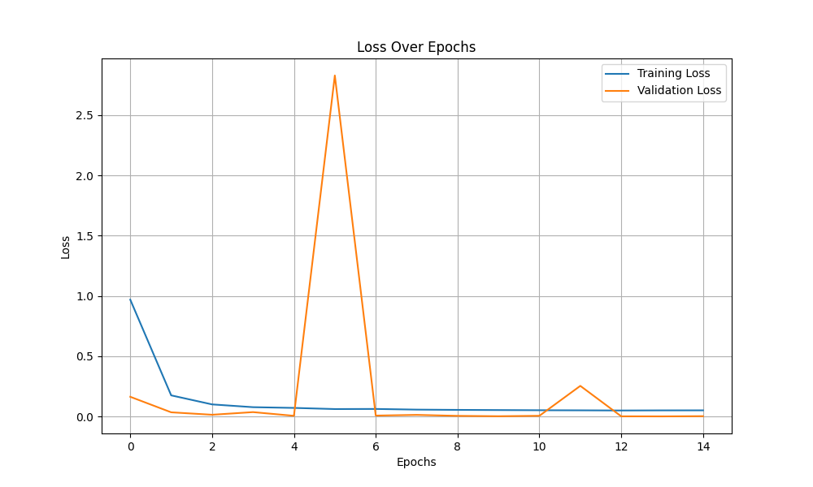
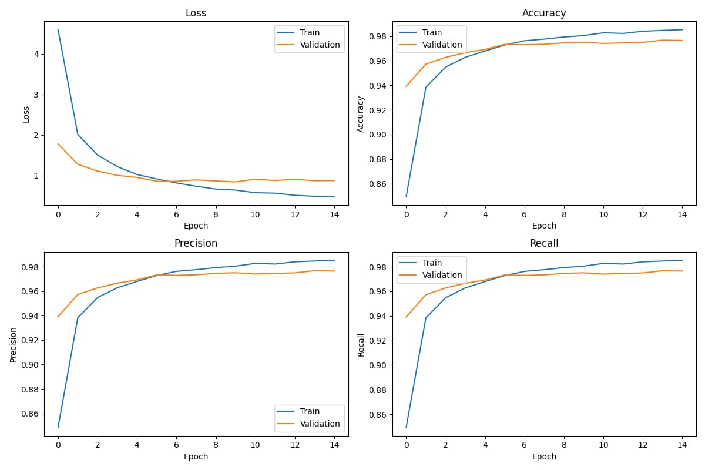
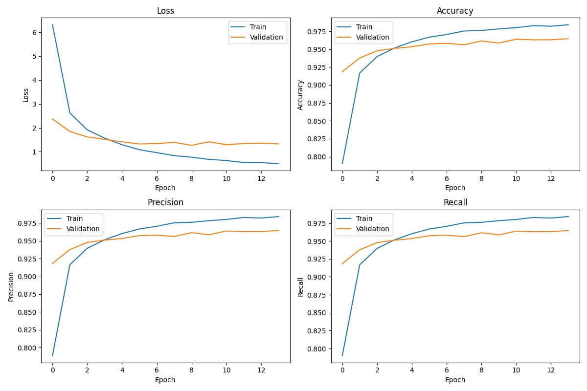
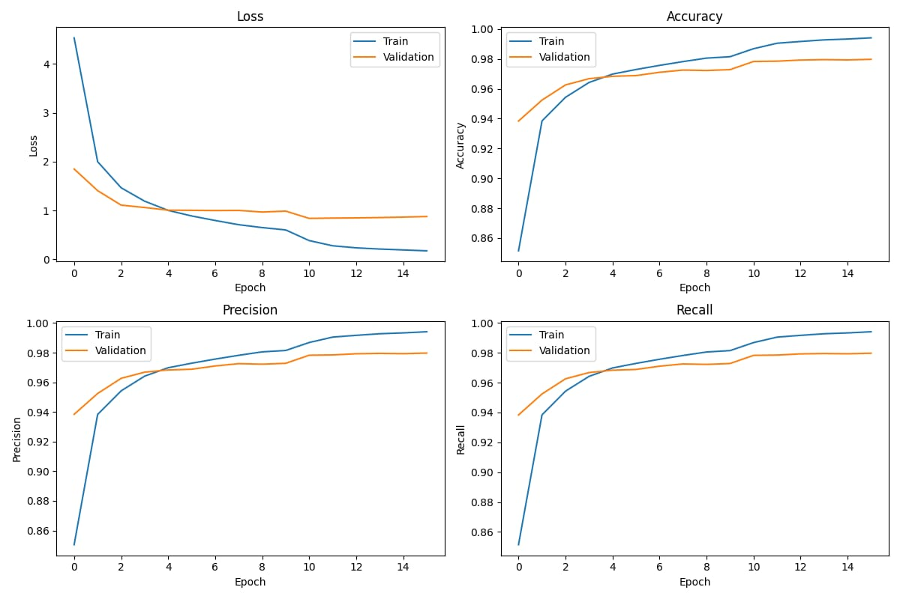

# 🧠 Neural Network Pipeline for MNIST, 8-Puzzle, and Phone Number Datasets

This project implements training pipelines using Multi-Layer Perceptrons (MLPs) on custom image datasets:
- MNIST handwritten digits
- 8-Puzzle board states
- Synthetic phone numbers

The aim is to compare model performance when trained on **balanced vs. imbalanced** datasets and understand the role of **data augmentation** in digit recognition.

---
 ## Run the Jupyter Notebook on Google Colab: [Open in Colab](https://colab.research.google.com/drive/16QcEDsXp8Z8UBMnYIz7aTlsk4f6I1yWA#scrollTo=r92V_kAVV2oq)

##  How It Works

1. **Data Generation**
   - `MNIST`: Downloaded via `torchvision`, split into balanced and imbalanced subsets.
   - `8-Puzzle`: Generated by rendering random permutations of tile positions, saved as images and `.pt` datasets.
   - `Phone Numbers`: Generated by creating random 10-digit numbers, optionally prepending country codes and applying transforms.

2. **Data Augmentation**
   - Includes transforms like rotation, normalization, and noise addition to improve generalization.

3. **Neural Network Architecture**
   - Simple feedforward MLP with two hidden layers.
   - Trained using CrossEntropyLoss and Adam optimizer.
   - Metrics: Accuracy, Loss, Precision, Recall

4. **Training Scripts**
   - Configurable via `config.json` to change hyperparameters, dataset path, batch size, etc.
   - Training and validation metrics are saved and plotted for analysis.

---
## Results - Synthetic Phone Numbers
### Accuracy

### Precision

### Recall

### Loss

## Results - 8 puzzle

##  Conclusion

This exercise highlights the effectiveness of well-balanced datasets and the significance of data augmentation in training deep learning models. It also demonstrates how modular and reusable pipelines can be created for a variety of computer vision tasks using MLPs. Balanced datasets consistently yielded higher generalization performance across different testing conditions.

