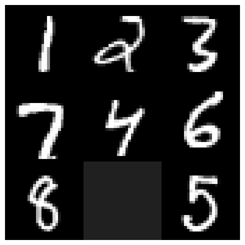
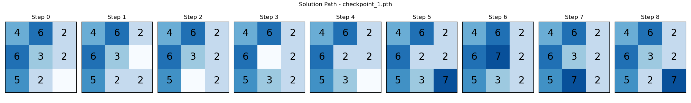
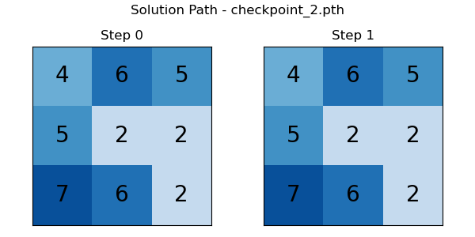

# 8-Puzzle Problem Solver using Neural Networks & LLM Reasoning

This project implements an end-to-end 8-puzzle solver pipeline that integrates:
- A trained Neural Network (NN) model to recognize puzzle tile configurations from image input.
- A Language Model (LLM) to reason through state transitions instead of traditional A* search.
- Visualization of puzzle states through each step of inference and decision-making.

  

---

## Description

The 8-puzzle problem consists of a 3x3 grid containing 8 numbered tiles and an empty space. The goal is to find the sequence of moves that leads from a given initial configuration to a goal configuration.

In this project:
- The NN model classifies the tiles in an image of the 8-puzzle board (trained from Hands-On Exercise 1).
- The recognized digits (tile states) are passed as a `<tag>` to an LLM agent.
- The LLM simulates logical reasoning to return **intermediate puzzle states** at each step of the solution path.
- The sequence of all states is saved in a `states.json` file.
- An interactive visual simulation presents:  
  `Input Image -> Predicted Tile Order -> Reasoned Steps`.

---

## Check Point 1:

## Check Point 2:

## Description

This exercise showcases how neural models can be combined with powerful reasoning capabilities of LLMs to replace traditional algorithmic approaches like A*. The visualization helps understand the model's decision-making process and bridges low-level vision tasks with high-level reasoning. This opens up exciting pathways for hybrid AI systems in planning and robotics.
